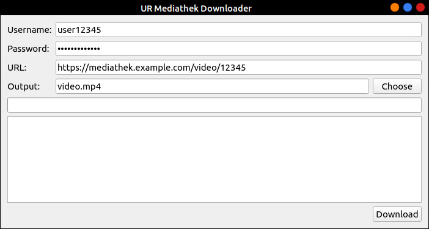

# UNOFFICIAL tools to download stuff from the UR mediathek

*Please note that this project is not affiliated, associated, authorized or endorsed by the University of Regensburg. It's a private project some of us did for fun in our free time and hope others will like it :)*

This repository contains scripts to download assets from the UR mediathek.

If you have suggestions or found bugs, feel free to open an issue or create a pull request!

## GUI

The gui provides functionality to download any video from the mediathek that you have access to.



### Build the GUI as a single executable file

Run `make` or `pyinstaller gui.py -F --name ur-downloader`.

## CLI

Alternatively, you can use the command line directly:

### Installation

1. Install Python
2. Install the `requests` package using `pip install requests`
3. Install [ffmpeg](https://ffmpeg.org/download.html)

You need to create a `credentials.json` file in this directory with the following content:

``` json
{
    "username": "vip12345",
    "password": "correcthorsebatterystaple"
}
```

Well, replace the entries with your own login information.

Tip: Restrict the read permissions to the `credentials.json` file, e.g. on linux: `chmod 600 credentials.json`

### Script: `video.py`

Downloads a video file from the UR Medithek.

Using you browser, navigate to the video in the mediathek. Copy the full URL (should begin with `https://mediathek2.uni-regensburg.de/playthis/`). Then, run

    python3 video.py <COPIED_URL>

The video file will be downloaded and saved in the current working directory.

Use `python3 video.py --help` to show more options.

### Scipt: `audio.py`

Downloads an audio file from the mediathek and stores it in the current directory.

Using you browser, navigate to the video in the mediathek. Copy the full URL (should begin with `https://mediathek2.uni-regensburg.de/playthis/`). Then, run

    python3 audio.py <COPIED_URL>

Use `python3 audio.py --help` to show more options.

## TODO

+ Use a proper python package structure
+ Handle bad input in gui
+ Include ffmpeg somehow
